# System Architecture

## HolisticHack - AI Red-Teaming Framework

```mermaid
flowchart TD
    Start([Start]) --> DeepSearch

    DeepSearch["🔍 DeepSearch Phase<br/>(Valyu API)<br/>━━━━━━━━━━<br/>15 Search Queries<br/>Extract Jailbreaks"]

    DeepSearch --> Config["⚙️ Configuration<br/>━━━━━━━━━━<br/>Attack Goals<br/>Risk Categories<br/>Attack Styles<br/>Parameters"]

    Config --> FirstTrials["🎯 Initial Trials<br/>━━━━━━━━━━<br/>Execute Seed Attacks<br/>Against Target Agents"]

    FirstTrials --> Evolution["🧬 Evolution Engine<br/>━━━━━━━━━━<br/>Genetic Algorithm<br/>SELECT → MUTATE<br/>BREED → EVALUATE"]

    Evolution --> Check{Success?}

    Check -->|Yes| Success["✅ Successful Jailbreaks<br/>━━━━━━━━━━<br/>71% Success Rate<br/>5/7 Agents Compromised"]

    Check -->|No| Evolution

    Success --> GlassBox["📦 Glass Box Analysis<br/>━━━━━━━━━━<br/>Extract Model Info<br/>MAP: Batch Results<br/>REDUCE: Aggregate"]

    GlassBox --> Synthesis["🧠 Insights Synthesis<br/>━━━━━━━━━━<br/>Pattern Analysis<br/>Cross-Agent Learning<br/>Success Factors"]

    Synthesis --> Present["📊 Presentation<br/>━━━━━━━━━━<br/>Comprehensive Report<br/>Attack Statistics<br/>Recommendations"]

    Present --> Improve["🔄 Continuous Improvement<br/>━━━━━━━━━━<br/>Feed Learnings Back<br/>Update Seed Pool<br/>Refine Strategies"]

    Improve -.->|New Seeds| DeepSearch

    style Start fill:#4a90e2,stroke:#2e5c8a,stroke-width:2px,color:#fff
    style DeepSearch fill:#9b59b6,stroke:#6c3483,stroke-width:2px,color:#fff
    style Config fill:#3498db,stroke:#2471a3,stroke-width:2px,color:#fff
    style FirstTrials fill:#1abc9c,stroke:#117864,stroke-width:2px,color:#fff
    style Evolution fill:#e67e22,stroke:#a04000,stroke-width:2px,color:#fff
    style Check fill:#f39c12,stroke:#b9770e,stroke-width:2px,color:#fff
    style Success fill:#27ae60,stroke:#1e8449,stroke-width:2px,color:#fff
    style GlassBox fill:#8e44ad,stroke:#6c3483,stroke-width:2px,color:#fff
    style Synthesis fill:#2980b9,stroke:#1a5276,stroke-width:2px,color:#fff
    style Present fill:#16a085,stroke:#0e6655,stroke-width:2px,color:#fff
    style Improve fill:#d35400,stroke:#a04000,stroke-width:2px,color:#fff
```

## Key Metrics

- **Total Attacks**: 1000+
- **Success Rate**: 71% (5/7 agents)
- **Attack Styles**: 10
- **Risk Categories**: 11
- **Evolution Generations**: 5-10
- **Cost**: ~$0.10-0.20 per run

## Technology Stack

- **Search**: Valyu API
- **Evolution**: Genetic Algorithms
- **Analysis**: Map-Reduce Pattern
- **Synthesis**: LLM-Powered Intelligence
- **Targets**: 7 Animal Agents (Elephant, Fox, Eagle, Ant, Wolf, Bear, Chameleon)
