# HolisticHack Architecture Diagram

## Simple Flow Diagram (For Hackathon Poster)

```mermaid
graph TD
    A[🔍 DeepSearch Phase<br/>Valyu API] -->|Discover Jailbreaks| B[🎯 Attack Goal Config<br/>Styles + Categories]
    B -->|Initialize Seeds| C[⚡ First Trials<br/>Batch Execution]
    C -->|WebSocket Stream| D{🧬 Evolution Engine}
    D -->|Evaluate Fitness| E[📊 Cluster & Score]
    E -->|Success?| F{✅ Attack Succeeded?}
    F -->|Yes| G[🏆 Success Pool]
    F -->|No| H[❌ Failed Pool]
    G --> I[🔬 Glass Box Summary<br/>Map-Reduce Batching]
    H --> I
    I -->|Synthesize| J[💡 Insights & Analysis]
    J -->|Present| K[👤 User Report<br/>Top Attacks + Stats]
    J -->|Feedback Loop| D
    E -->|Elite Selection| L[🎯 Mutation<br/>10 Attack Styles]
    L -->|Generate Variants| D

    style A fill:#e1f5ff
    style D fill:#fff4e6
    style I fill:#f3e5f5
    style K fill:#e8f5e9
```

## Detailed Architecture Flow (Full System)

```mermaid
graph TB
    subgraph Discovery["🔍 PHASE 1: DeepSearch & Discovery"]
        A1[Valyu API Search<br/>15 Queries]
        A2[Extract Research<br/>Papers & Blogs]
        A3[LLM Synthesis<br/>Together AI]
        A4[Generate Seeds<br/>JSON + Python]
        A1 --> A2 --> A3 --> A4
    end

    subgraph Config["⚙️ PHASE 2: Attack Configuration"]
        B1[Load Seeds<br/>Hardcoded + Discovered]
        B2[Assign Parameters<br/>Style + Category]
        B3[Create AttackNodes<br/>Generation 0]
        B1 --> B2 --> B3
    end

    subgraph Execution["⚡ PHASE 3: Parallel Execution"]
        C1[Batch Attacks<br/>Size: 5-20]
        C2[HTTP POST<br/>AWS API Gateway]
        C3[WebSocket Stream<br/>Real-time Results]
        C4[LLM Response<br/>From 7 Agents]
        C1 --> C2 --> C3 --> C4
    end

    subgraph Evaluation["📊 PHASE 4: Evaluation & Clustering"]
        D1[LLM-as-Judge<br/>Llama Guard]
        D2[Fitness Scoring<br/>0.0 - 1.0]
        D3[Cluster by Style<br/>+ Category]
        D4{Success?<br/>Score ≥ 6/10}
        C4 --> D1 --> D2 --> D3 --> D4
    end

    subgraph Classification["🗂️ PHASE 5: Classification"]
        E1[✅ Success Pool<br/>Harmful Responses]
        E2[❌ Failed Pool<br/>Safe Responses]
        D4 -->|Yes| E1
        D4 -->|No| E2
    end

    subgraph MapReduce["🔬 PHASE 6: Glass Box Map-Reduce"]
        F1[Batch Successes<br/>Group by Cluster]
        F2[Batch Failures<br/>Group by Cluster]
        F3[Map: Extract Patterns<br/>Per Cluster]
        F4[Reduce: Aggregate Stats<br/>Success Rates]
        E1 --> F1 --> F3
        E2 --> F2 --> F3
        F3 --> F4
    end

    subgraph Synthesis["💡 PHASE 7: Insight Synthesis"]
        G1[Top 10 Attacks<br/>By Fitness Score]
        G2[Cluster Analysis<br/>Best Techniques]
        G3[Success Metrics<br/>Rates + Categories]
        G4[Generate Report<br/>JSON + Markdown]
        F4 --> G1 --> G2 --> G3 --> G4
    end

    subgraph Presentation["📊 PHASE 8: User Presentation"]
        H1[📄 Comprehensive Summary<br/>Agent-by-Agent]
        H2[📈 Statistics Dashboard<br/>Success Rates]
        H3[🎯 Top Attacks<br/>With Evidence]
        H4[💬 Recommendations<br/>Defense Strategies]
        G4 --> H1
        G4 --> H2
        G4 --> H3
        G4 --> H4
    end

    subgraph Evolution["🧬 PHASE 9: Evolution & Improvement"]
        I1[Elite Selection<br/>Top 3 per Cluster]
        I2[Mutation Engine<br/>10 Attack Styles]
        I3[Cross-Breeding<br/>Hybrid Generation]
        I4[New Population<br/>Generation N+1]
        D3 --> I1
        I1 --> I2 --> I3 --> I4
    end

    A4 --> B1
    B3 --> C1
    I4 --> C1

    style Discovery fill:#e1f5ff
    style Config fill:#fff3e0
    style Execution fill:#f3e5f5
    style Evaluation fill:#e8f5e9
    style Classification fill:#fce4ec
    style MapReduce fill:#f1f8e9
    style Synthesis fill:#fff9c4
    style Presentation fill:#e0f2f1
    style Evolution fill:#ede7f6
```

## Component Interaction Diagram

```mermaid
sequenceDiagram
    participant User
    participant DeepSearch as 🔍 DeepSearch<br/>(Valyu API)
    participant Config as ⚙️ Config Engine
    participant Executor as ⚡ Executor<br/>(AsyncIO)
    participant Target as 🎯 Target LLM<br/>(7 Agents)
    participant Judge as ⚖️ LLM Judge<br/>(Llama Guard)
    participant Cluster as 📊 Cluster Manager
    participant MapReduce as 🔬 Map-Reduce
    participant Evolution as 🧬 Evolution

    User->>DeepSearch: Request new jailbreaks
    DeepSearch->>DeepSearch: Search 15 queries
    DeepSearch->>Config: Return synthesized seeds

    Config->>Config: Assign styles + categories
    Config->>Executor: Initialize AttackNodes

    loop For each generation
        Executor->>Executor: Batch attacks (size 5-20)

        par Parallel Execution
            Executor->>Target: HTTP POST (Attack 1)
            Executor->>Target: HTTP POST (Attack 2)
            Executor->>Target: HTTP POST (Attack N)
        end

        Target-->>Executor: WebSocket Stream responses

        par Evaluate each response
            Executor->>Judge: Evaluate attack 1
            Judge-->>Executor: Score: 0.85 (Success)
            Executor->>Judge: Evaluate attack 2
            Judge-->>Executor: Score: 0.45 (Fail)
        end

        Executor->>Cluster: Add scored nodes
        Cluster->>Cluster: Group by style + category

        Cluster->>MapReduce: Batch successes + failures
        MapReduce->>MapReduce: Map patterns per cluster
        MapReduce->>MapReduce: Reduce to aggregate stats

        MapReduce->>User: Stream insights (JSON)

        MapReduce->>Evolution: Send cluster stats
        Evolution->>Evolution: Select elite (top 3)
        Evolution->>Evolution: Mutate with 10 styles
        Evolution->>Evolution: Cross-breed clusters
        Evolution->>Executor: New generation population
    end

    MapReduce->>User: Final comprehensive report
```

## Technology Stack

```mermaid
graph LR
    subgraph APIs["External APIs"]
        A1[Valyu API<br/>Research Search]
        A2[Together AI<br/>LLM Synthesis]
        A3[OpenRouter<br/>Attack Mutation]
        A4[AWS Bedrock<br/>Claude Models]
    end

    subgraph Core["Core System"]
        B1[Python AsyncIO<br/>Concurrency]
        B2[ThreadPoolExecutor<br/>Parallel Execution]
        B3[HTTP/REST<br/>JSON Protocol]
        B4[Streaming<br/>Real-time Updates]
    end

    subgraph Target["Target System"]
        C1[AWS API Gateway<br/>Endpoints]
        C2[7 Agent Models<br/>🐘🦊🦅🐜🐺🐻🦎]
    end

    subgraph Analysis["Analysis Tools"]
        D1[Llama Guard<br/>Safety Classifier]
        D2[LLM-as-Judge<br/>Scoring Engine]
        D3[Cluster Manager<br/>Pattern Detection]
        D4[Map-Reduce<br/>Batch Processing]
    end

    A1 --> B1
    A2 --> B1
    A3 --> B1
    A4 --> B1

    B1 --> B3
    B2 --> B3
    B3 --> B4

    B4 --> C1
    C1 --> C2

    C2 --> D1
    D1 --> D2
    D2 --> D3
    D3 --> D4

    style APIs fill:#e1f5ff
    style Core fill:#fff3e0
    style Target fill:#f3e5f5
    style Analysis fill:#e8f5e9
```

## Data Flow: Node Generation & Evolution

```mermaid
flowchart TD
    A[Seed Attack Node<br/>Generation 0] -->|WebSocket POST| B[Target LLM]
    B -->|Stream Response| C[Evaluator<br/>LLM Judge]
    C -->|fitness_score| D{Score ≥ 0.6?}

    D -->|Yes| E[Success Pool<br/>✅ Harmful]
    D -->|No| F[Failed Pool<br/>❌ Safe]

    E --> G[Cluster Assignment<br/>By Style + Category]
    F --> G

    G --> H[Elite Selection<br/>Top 3 per Cluster]

    H --> I[Mutation Phase]
    I --> J[Apply Style 1:<br/>Slang]
    I --> K[Apply Style 2:<br/>Role-play]
    I --> L[Apply Style 3:<br/>Technical]

    J --> M[New AttackNode<br/>Generation 1]
    K --> M
    L --> M

    H --> N[Cross-Breeding<br/>Hybrid Creation]
    N --> M

    M -->|Loop| A

    G --> O[Map-Reduce Batch]
    O --> P[Synthesize Insights]
    P --> Q[User Report]

    style E fill:#c8e6c9
    style F fill:#ffcdd2
    style M fill:#fff9c4
    style Q fill:#e1bee7
```

## Key Metrics

| Phase | Metric | Value |
|-------|--------|-------|
| **DeepSearch** | Queries per run | 15 × 5 results = 75 |
| **Execution** | Batch size | 5-20 attacks |
| **Parallel** | Concurrent threads | 10-20 |
| **Evaluation** | Success threshold | ≥ 6/10 (0.6) |
| **Clustering** | Similarity threshold | 0.7 |
| **Evolution** | Elite selection | Top 3 per cluster |
| **Mutation** | Styles applied | 10 attack styles |
| **Generation** | Cycle time | 5-10 minutes |
| **Results** | Top attacks shown | 10 |

## File Reference

| Component | File Location |
|-----------|---------------|
| DeepSearch | `mutations/jailbreak_seed_discovery.py` |
| Attack Engine | `mutations/mutation_attack_system.py` |
| Execution | `mutations/mutation_attacks.py` |
| API Clients | `mutations/api_clients.py` |
| WebSocket Stream | `track_c_dear_grandma/elephant_agent_5_stream.py` |
| Reports | `FINAL_COMPREHENSIVE_SUMMARY.md` |

---

**Notes for Excalidraw Import:**
- Copy the Mermaid code blocks to https://mermaid.live
- Export as PNG or SVG
- Import into Excalidraw
- Alternatively, use Excalidraw's Mermaid plugin
